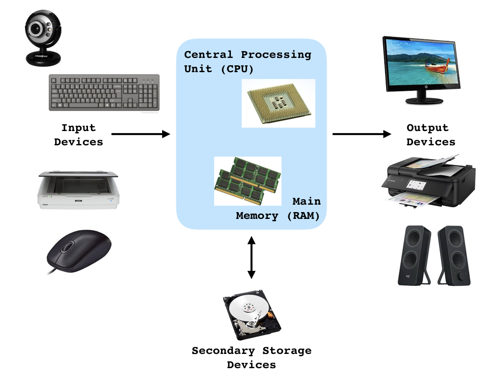

## Introduction 
+ Please ask questions during lectures & throughout the day!
+ To access course materials please visit the [CSULB_Intro_R website](https://datumu.github.io/CSULB_Intro_R/).
+ **Please [download](https://github.com/datumU/CSULB_Intro_R/archive/master.zip) & unzip the Github repository!**

## Agenda
1. Some basics
2. Making a sandwich
3. Discussion & vocab lesson
4. Programming Languages

## Why Program?
+ Many possible uses for computers (smartphones, tablets, etc.)
+ Computers are stupid--they don't know how to do anything unless they're told
+ A *program* is a set of instructions a computer follows to perform some task
+ Programming is both an art and a science
    + Art: every aspect carefully designed (e.g. appearance, user-friendlyness, etc.)
    + Science: testing, correction, redisigning, collaborating required
+ Programs should be functional, efficient, and easy to use

## Computer Systems
+ *Hardware*: physical components of the machine

## Computer Systems
+ *Software*: programs that control everything a computer does 
    + System Software: control & manage basic operations
    + Application Software: make computer useful for everyday tasks
+ We will use *software development tools*, a special type of system software, to develop simple programs
    + Compilers: transform a program into machine language
    + Interpreters: execute a program directly  
    + Integrated development environments (IDEs): tools to make programmers' lives easier

## What is a Program?
+ Set of instructions that tells a computer how to solve a problem or perform a task
    + Collectively, these instructions are called an *algorithm*
    + Can think of algorithms as recipies
    + Sequence is crucial!
+ Human-readable
+ Compiler or interpreter converts into machine language that the CPU understands
    + E.g., `2 + 2` becomes `10100010 11101011`

## Making a Sandwich
Let's write an algorithm with instructions on how to make a BLT.

## Making a Sandwich - Discussion
+ We just wrote *pseudocode*, or an informal high-level description of a program or algorithm, for making a BLT!
+ We must convert this pseudocode into code (e.g., language) that the computer can interpret.
+ Many different ways to perform this translation
    + Think of pseudocode as cave drawings and code as English, German, or Chinese
    + Referred to as programming languages

## Programming Languages
+ A *programming language* is a formal language that specifies a set of instructions that can be used to produce output. 
+ Programming languages are defined by many characteristics, including
1. Syntax: describes valid combinations of symbols 
    + `2 + 2` is syntactically correct, but `+ 2 2` isn't
2. Semantics: meaning given to those combinations
    + `2 + 2` means add 2 to 2
3. Implementation (interpreted vs. compiled)
+ Many examples of programming languages including R, Python, C/C++, Matlab

## What is R?
+ R is a free software environment for statistical computing and graphics
    + See http://www.r-project.org/ for more info 
+ Compiles and runs on a wide variety of UNIX platforms, Windows and Mac OS
+ Open source and free
+ Interpreted programming language
+ Object-oriented
    + Everything in R is an object (data, functions, etc.)
+ Highly extendable
    + You can write your own custom functions
    + There are over 12,000 free add-on packages

## RStudio
+ RStudio is an open-source integrated development environment (IDE) for R.
+ Visit http://rstudio.org/ for more info
+ Please note that you must have R already installed before installing R Studio!
+ **In the repository that you downloaded, there is a file called `CSULB_Intro_R.Rproj` -- please open it in RStudio.**

## Fundamentals of R
+ When you type commands at the prompt '>' and hit ENTER
    + R tries to interpret what you've asked it to do (evaluation)
    + If it understands what you've written, it does it (execution)
    + If it doesn't, it will likely give you an error or a warning
+ Some commands trigger R to print to the screen, others don't
+ If you type an incomplete command, R will usually respond by changing the command prompt to the '+' character
    + Hit ESC on a MAC to cancel
    + Type _Ctrl_ + *C* on Windows and Linux to cancel

## R Syntax
TODO: briefly discuss basic syntax

## Making a Sandwich in R
TODO: go over Micah's script in RStudio...

TODO: add here with syntax highlighting and results

## Summary
+ A program is a set of instructions a computer follows to perform some task
+ There are many programming languages that we can use to write code, each with its own syntax and semantics
+ R is an open-source, interpreted language
+ RStudio is a useful environment for developing R code
+ BLTs are delicious and making me hungry...

## Up Next
TODO: add in schedule information here (e.g., exercise, break/lunch)
