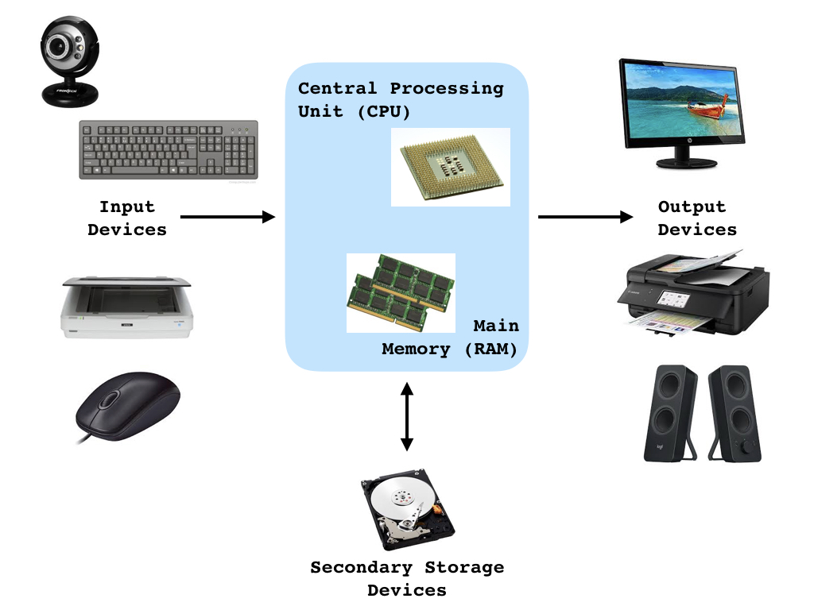

## Introduction 
+ Please ask questions during lectures & throughout the day!
+ To access course materials please visit the [CSULB_Intro_R website](https://datumu.github.io/CSULB_Intro_R/).
+ **Please [download](https://github.com/datumU/CSULB_Intro_R/archive/master.zip) & unzip the Github repository!**


## Agenda
1. Some basics
2. Making a sandwich
3. Discussion & vocab lesson
4. Programming Languages
5. The R language


## Why Program?
+ Many possible uses for computers (smartphones, tablets, etc.)
+ Computers are stupid--they don't know how to do anything unless they're told
+ A *program* is a set of instructions a computer follows to perform some task
+ Programming is both an art and a science
    + Art: every aspect carefully designed (e.g. appearance, user-friendlyness, etc.)
    + Science: testing, correction, redisigning, collaborating required
+ Programs should be functional, efficient, and easy to use


## Computer Systems
+ *Hardware*: physical components of the machine




## Computer Systems
+ *Software*: programs that control everything a computer does 
    + System Software: control & manage basic operations
    + Application Software: make computer useful for everyday tasks
+ We will use *software development tools*, a special type of system software, to develop simple programs
    + Compilers: transform a program into machine language
    + Interpreters: execute a program directly  
    + Integrated development environments (IDEs): tools to make programmers' lives easier


## What is a Program?
+ Set of instructions that tells a computer how to solve a problem or perform a task
    + Collectively, these instructions are called an *algorithm*
    + Can think of algorithms as recipies
    + Sequence is crucial!
+ Human-readable
+ Compiler or interpreter converts into machine language that the CPU understands
    + E.g., `2 + 2` becomes `10100010 11101011`
+ Important aspects:
    1. Correctness
    2. Efficency


## Examples of Algorithms
+ Google Maps: route finding algorithm to find most efficent path from A to B
+ Skype: audio & video compression algorithms
+ Video games: rendering algorithms to color character characters
+ Biological sciences: algorithms to design molecular structure of drugs


## Algorithm for making a BLT
**Input:** Slices of bread, slices of tomato, pieces of lettuce, strips of cooked bacon

**Output:** BLT sandwich

put down a slice of bread

put a slice of tomato on top of the bread

put a piece of lettuce on top of the tomato

put 3 strips of cooked bacon on top of the lettuce 

put a second slice of bread on top of the bacon

return a BLT sandwich


## Making a BLT - Discussion
+ We just wrote *pseudocode*, or an informal high-level description of a program or algorithm, for making a BLT!
+ We must convert this pseudocode into code (e.g., language) that the computer can interpret.
+ Many different ways to perform this translation
    + Think of pseudocode as cave drawings and code as English, German, or Chinese
    + Referred to as programming languages
    

## Algorithm for swapping two variables
**Input:** Two variables: `var1` and `var2`

**Output:** Same variables with values swapped

Copy value of `var1` to `temp`
   
Copy value of `var2` to `var1`
          
Copy value of `temp` to `var2`


## Programming Languages
+ A *programming language* is a formal language that specifies a set of instructions that can be used to produce output. 
+ Programming languages are defined by many characteristics, including
1. Syntax: describes valid combinations of symbols 
    + `2 + 2` is syntactically correct, but `+ 2 2` isn't
2. Semantics: meaning given to those combinations
    + `2 + 2` means add 2 to 2
3. Implementation (interpreted vs. compiled)
+ Many examples of programming languages including R, Python, C/C++, Matlab


## What is R?
+ R is a free software environment for statistical computing and graphics
    + See http://www.r-project.org/ for more info 
+ Compiles and runs on a wide variety of UNIX platforms, Windows and Mac OS
+ Open source and free
+ Interpreted programming language
+ Object-oriented
    + Everything in R is an object (data, functions, etc.)
+ Highly extendable
    + You can write your own custom functions
    + There are over 12,000 free add-on packages


## RStudio
+ RStudio is an open-source integrated development environment (IDE) for R.
+ Visit http://rstudio.org/ for more info
+ Please note that you must have R already installed before installing R Studio!
+ **In the repository that you downloaded, there is a file called `CSULB_Intro_R.Rproj` -- please open it in RStudio.**


## How R Works
+ When you type commands at the prompt '>' and hit ENTER
    + R tries to interpret what you've asked it to do (evaluation)
    + If it understands what you've written, it does it (execution)
    + If it doesn't, it will likely give you an error or a warning
+ Some commands trigger R to print to the screen, others don't
+ If you type an incomplete command, R will usually respond by changing the command prompt to the '+' character
    + Hit ESC on a MAC to cancel
    + Type _Ctrl_ + *C* on Windows and Linux to cancel


## Fundamentals of R
+ Everything in R is an **object** with a descriptive **name**
    + Variables, data, functions, etc.
+ **Variables** store data that can be referenced and manipulated 
    + Containers that hold information
+ Can perform actions on objects using **operators**
    + Assignment: `<-` and `=`
    + Arithmetic: addition `+`, subtraction `-`, multiplication `*`, division `/`, etc.
    + Logical: greater than `>`, less than `<`, equal to `==`, etc.


## Naming Conventions for Objects
+ Start with a letter A-Z or a-z
+ Can include letters, digits (0-9), dots (.), and underscores (_)
+ Case sensitive!
    + `X != x`
  
    
## Simple Example
Let's try some simple assignment operations...
```{r}
n <- 10  # assign the value 10 to an object named n
n  # look at what R stored it as

N <- 5  # assign the value 5 to an object named N
N  # inspect the result

n == N  # are n and N equal?

n + N  # add n and N
```


## Making a BLT in R
Let's implement our BLT sandwich in R

```{r, results="hold"}
# ingredients
bread <- "slice of bread"
tomato <- "slice of tomato"
lettuce <- "piece of romaine lettuce"
bacon <- "cooked strips of bacon"

# output the sandwich
print(bread)
print(bacon)
print(lettuce)
print(tomato)
print(bread)
```


## Swapping two variables in R
Let's implement our swap algorithm in R

```{r}
# inputs
var1 <- 10
var2 <- 15

# perform the swap
temp <- var1
var1 <- var2
var2 <- temp

# inspect the results
var1
var2
```


## Summary
+ A program is a set of instructions a computer follows to perform some task
+ There are many programming languages that we can use to write code, each with its own syntax and semantics
+ R is an open-source, interpreted language
+ RStudio is a useful environment for developing R code
+ BLTs are delicious and making me hungry...


## Up Next
+ Active Learning Exercise
+ Break/Lunch?
+ Return at XXXX to discuss the exercise


## Active Learning
+ How would you tell someone how to make a BLT sandwich who has never had a sandwich before?
+ Let's write an algorithm with instructions on how to do so.
    + List the ingredients
    + Describe how to assemble them into a BLT
    + Follow the template on the previous slide
    
    
## Algorithm: Find the Height of the Tallest Person in the Room
**Input:** List of heights of people in the room, $H = [height_1, height_2, \ldots]$

**Output:** Height of the tallest person in the room, $tallest$

$tallest = height_1$

for each $item$ in $H$, do

&nbsp;&nbsp;&nbsp;&nbsp; if $item > tallest$, then

&nbsp;&nbsp;&nbsp;&nbsp;&nbsp;&nbsp;&nbsp;&nbsp; $tallest = item$

return $tallest$


